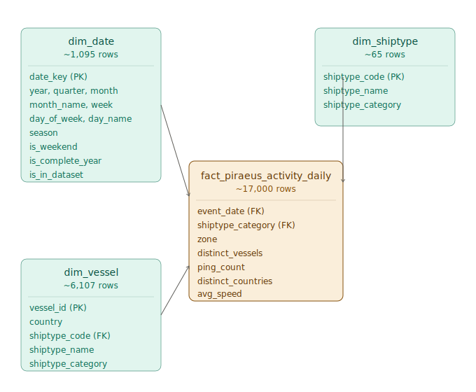

# Piraeus Vessel Activite - Maritime Data ELT Pipeline

End-to-end data engineering project built as the capstone for the **[Data Engineering Zoomcamp](https://datatalks.club/blog/data-engineering-zoomcamp.html)** by DataTalks.Club — a free, hands-on course covering batch and streaming data pipelines, warehousing, and orchestration.

The project applies the concepts taught in the course to a real-world dataset: 244M AIS vessel records from the Port of Piraeus (one of Europe's busiest ports).

## 🔗 Live Dashboard

[**View interactive dashboard on Looker Studio →**](https://datastudio.google.com/s/sbhVDeMEKK4)

## Business Question

**How does vessel activity in and around the Port of Piraeus vary by vessel type, season, and zone across 2017–2019?**

The dashboard answers this with two tiles:

- **Tile 1 — Weekly Active Vessels by Type (2018–2019)**
  - Line chart showing weekly distinct vessel counts per shiptype
  - Reveals the seasonal rhythm: passenger ferries spike in summer (Greek tourism), cargo stays steady year-round, recreational traffic surges June–September
  
- **Tile 2 — Seasonal Vessel Mix by Type**
  - Stacked bar chart showing vessel-type composition across the four seasons
  - Confirms the "dual character" of Piraeus: commercial hub (Cargo + Tanker + Passenger) + recreational destination (Pleasure Craft)
  - A zone filter (at-port vs. in-approaches) shows how different categories cluster — tankers and cargo wait in approaches, ferries turn around at the port itself

## Data Engineering Concepts Applied

All core concepts from the Zoomcamp, grounded in a real workload:

- **Containerization** — Kestra is Deployed on GCP, running on a GCE VM with Docker
- **Infrastructure as Code** — dbt project tracked in Git, versioned transformations
- **Workflow Orchestration** — Kestra flows extracting from Zenodo, decompressing, and loading to GCS (parameterized by year and dataset type)
- **Data Lake** — raw CSVs landed in Google Cloud Storage, partitioned by year
- **Data Warehouse** — BigQuery as the analytical engine, partitioned by month, clustered by category and zone
- **ELT Pattern** — Kestra handles Extract + Load; dbt handles Transform inside the warehouse
- **Dimensional Modeling** — star schema with a pre-aggregated fact and three dimensions
- **Data Quality** — filtering for invalid AIS codes and malformed coordinates upstream
- **Visualization** — Looker Studio connected directly to the marts layer

## Data Engineering Flow

```
Zenodo (academic data repository)
    ↓ HTTP download (yearly ZIP archives, ~10 GB each)
Kestra (orchestration, GCE VM)
    ↓ decompress + upload monthly CSVs
GCS (data lake — raw layer)
    ↓ BigQuery external tables + native load
BigQuery (data warehouse, europe-west1)
    ↓ dbt transformations (staging → intermediate → marts)
Looker Studio (dashboard)
```

## Data Model

Star schema centered on a pre-aggregated daily activity fact.



## Tech Stack

- **Orchestration:** Kestra (on Google Compute Engine)
- **Data Lake:** Google Cloud Storage
- **Data Warehouse:** BigQuery
- **Transformations:** dbt Cloud (Fusion engine)
- **Visualization:** Looker Studio
- **Languages:** SQL, YAML, Jinja

## Data Source

**Piraeus AIS Dataset** (Tritsarolis, Kontoulis, & Theodoridis, 2022), University of Piraeus Data Science Lab.

- 244M AIS records across the Saronic Gulf (May 2017 – Dec 2019)
- Accompanying ESRI shapefiles for Piraeus port + territorial waters polygons
- **Paper:** https://doi.org/10.1016/j.dib.2021.107782
- **Data:** https://doi.org/10.5281/zenodo.5562629
- **License:** CC BY 4.0

## What the Analysis Showed

- **210M pings** filtered and zoned (after territorial waters clip)
- **17,000 rows** in the final fact table (10,000x compression from raw)
- Passenger traffic at Piraeus **triples between winter and summer**, reflecting Greek island ferry seasonality
- Cargo and Tanker activity stays **remarkably steady** year-round (commercial shipping is not seasonal)
- **Pleasure Craft is a dominant category** — surprising finding: recreational boats contribute more total vessel-days than commercial cargo
- Summer weeks see **30–40% more vessels** in territorial waters vs. winter baseline

## Dataset Citation

Tritsarolis, A., Kontoulis, Y., & Theodoridis, Y. (2022). The Piraeus AIS dataset for large-scale maritime data analytics. *Data in Brief*, 40, 107782. https://doi.org/10.1016/j.dib.2021.107782

## License

- Project code: MIT
- Dataset: CC BY 4.0 (original license preserved)


